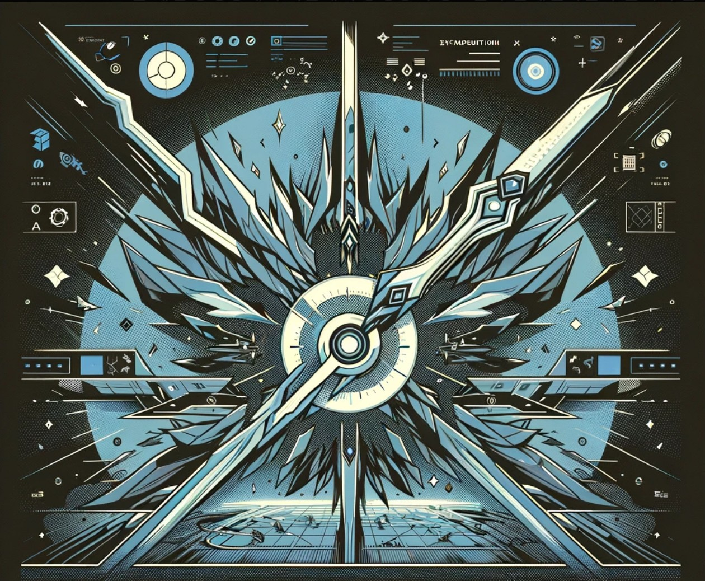

# <h1 align="center"><br>LoL Replay Extractor</h1>

<p align="center">
!! LoL Replay Extractor is still in development, any bugs can appear !!
</p>

<p align="center">
    <a href="https://www.python.org"></a>
    <a href=""></a>
    <a href="https://github.com/league-of-legends-replay-extractor/pyLoL/stargazers"></a>
    <a href="https://pylol.readthedocs.io/en/latest/?style=for-the-badge"></a>
    <a href="./"></a>
    <a href="./LICENSE"></a>
    <a href=""></a>

</p>

<p align="center">
`LoL Replay Extractor 🌟` is a program for gathering positional data and providing analytics from League of Legends videos. It can be used to automatically gather spatiotemporal data (player locations over time) from a series of Youtube/locally stored videos
</p>

<p align="center">
    ✔ Any PRs are welcome, Watch <a href="https://github.com/league-of-legends-replay-extractor/pyLoL/tree/nightly">nightly</a> branch for recent updates!
</p>

## ✅What is pyLoL?

pyLoL is 'League of Legends' replays data extracting program.

## ✅What can pyLoL do?

[1] can save replay files(.rofl) automatically.

[2] can get the location of players every one second.

[3] can get the location of wards.

## 🚀Quickstart

- youtube_guide
<p align="center">
  <a href="https://youtu.be/0z9_jyfS1TQ">
    
  </a>
</p>

Get started with pyLoL in nine steps:

[](https://colab.research.google.com/drive/1HAQjHIVXE__Pb1KiBHG1I2jIQbFfWJ3q?usp=sharing)

1. First, clone this repository.

```bash
git clone https://github.com/league-of-legends-replay-extractor
```

2. Install Requirements

```bash
pip install -r requirements.txt
```

3. Make python project to Package
   
```bash
python setup.py develop
```

4. Directory settings


   In replay_scraper.ipynb, modify the path to suit your local environment
   * game_dir: League of Legends game directory.
   * replay_dir: League of Legends *.rofl replay directory.
   * dataset_dir: JSON replay files output directory.
   * replay_speed: League of Legends client replay speed multiplier.
   * scraper_dir: Directory of the scraper program.
   
```python
rd.set_replays_dir(rd,folder_dir = r'C:\Users\username\Documents\League of Legends\Replays')  # replay download directory

rs.__init__(rs, game_dir = r'C:\Riot Games\League of Legends\Game',                          
            replay_dir = r'C:\Users\username\Documents\League of Legends\Replays',               
            dataset_dir = r'C:\Users\username\Documents\League of Legends\Dataset',              
            scraper_dir = r'C:\Users\username\Desktop\pyLoL\pyLoL\autoLeague\replays',
            replay_speed=40,
            region="KR")
ie.__init__(ie,dataset_dir=r'C:\Users\username\Desktop\pyLoL')
```

5. API KEY
   You can get API KEY from riot developer portal : https://developer.riotgames.com
   
```python
dg.__init__(dg, api_key='RIOT_API_KEY' , count=20)
```

6. Gathering MatchIds filtered by {queue, tier, division, max_ids, patch_start_datetime}

   if you wanna download matchIds from 5000 MASTER I in SOLORANK users in specific patch,
   
```python
dg.get_tier_matchIds(dg, queue='RANKED_SOLO_5x5', tier='MASTER', division='I' , max_ids=5000, patch_start_datetime='2023.10.26')
```


7. Save replay files for the match IDs obtained above

```python
from tqdm import tqdm
import time

for matchId in tqdm(matchIds_challenger[:1000], 
                    desc = 'Gathering Replay_files(.rofl) from LoL Client... ', ## Print statement for progress at the front
                    ncols = 130, ## Adjust width for progress display
                    ascii = ' =', 
                    leave=True):
    
    try: #if this match id outdated, skip
        rd.download(rd, matchId)
        time.sleep(7)
    except:
        pass
```


8. Run replay => Save minimap capture video

* Option
   * All) no fog of war
   * Blue) fog of war in Blue team
   * Red)  fog of war in Red team
```python
for replay in tqdm(replays,
                    desc = 'Extracting Replay_Minimaps from LoL Client... ', ## Print statement for progress at the front
                    ncols = 200, ## Adjust width for progress display
                    ascii = ' =', 
                    leave=True
                    ):
    
    rs.run_client(rs,
                  replay_path = rf'{rs.get_replay_dir(rs)}\{replay}', 
                  gameId = replay.split('.')[0],
                  start=5*60 - 5, 
                  end=25*60 - 5, 
                  speed=10, 
                  paused=False, 
                  team="All")
```


9. Extract Realtime KDA, CS using OCR
    
```python
from autoLeague.preprocess.ocr_center_window import OcrCenter as oc
oc.__init__(oc, project_folder_dir = r'C:\Users\username\Desktop\pyLoL')
oc.get_ocr(oc)
```


## 🎯Champion Tracking Model( Using Minimap Frame dataset )

- Champion Tracking (Roboflow)
- 

Then, You can use this tracking model ( Performance | mAP : 92.2% | precision : 91.3% | recall : 90.2% )
- Infer on Local and Hosted Images
    To install dependencies,

        pip install roboflow.

    Then, add the following the following code snippet to a Python script:
  
        from roboflow import Roboflow
        rf = Roboflow(api_key="API_KEY")
        project = rf.workspace().project("lolpago-multi-tracking-service")
        model = project.version(18).model
        
        # infer on a local image
        print(model.predict("your_image.jpg", confidence=40, overlap=30).json())
        
        # visualize your prediction
        # model.predict("your_image.jpg", confidence=40, overlap=30).save("prediction.jpg")
        
        # infer on an image hosted elsewhere
        # print(model.predict("URL_OF_YOUR_IMAGE", hosted=True, confidence=40, overlap=30).json())

## 🌠Give this Project a Star

This project is an open source project. If you like what you see, please give it a star on github.

## ☕Buy me a coffee

<p align="center">
   <a href="https://www.buymeacoffee.com/201902664" target="_blank"></a>   
</p>

## 📝Citing this Paper

[Win Prediction in MOBA Games Using Time-Series Location Data : Case Study in League of Legends (LoL)](https://journal-home.s3.ap-northeast-2.amazonaws.com/site/2023w/abs/0632-RRHIQ.pdf)

      @article{김성윤2023시계열,
        title={시계열 위치 데이터를 활용한 MOBA 게임 승패 예측: 리그오브레전드 사례 분석},
        author={김성윤 and 이태홍 and 양희철},
        journal={한국통신학회 학술대회논문집},
        pages={1205--1206},
        year={2023}
      }


|kimsy1106|tim000519|cye_dev|
|------|---|---|
|developing replay extractor|manage "read the docs"|manage "read the docs"|


